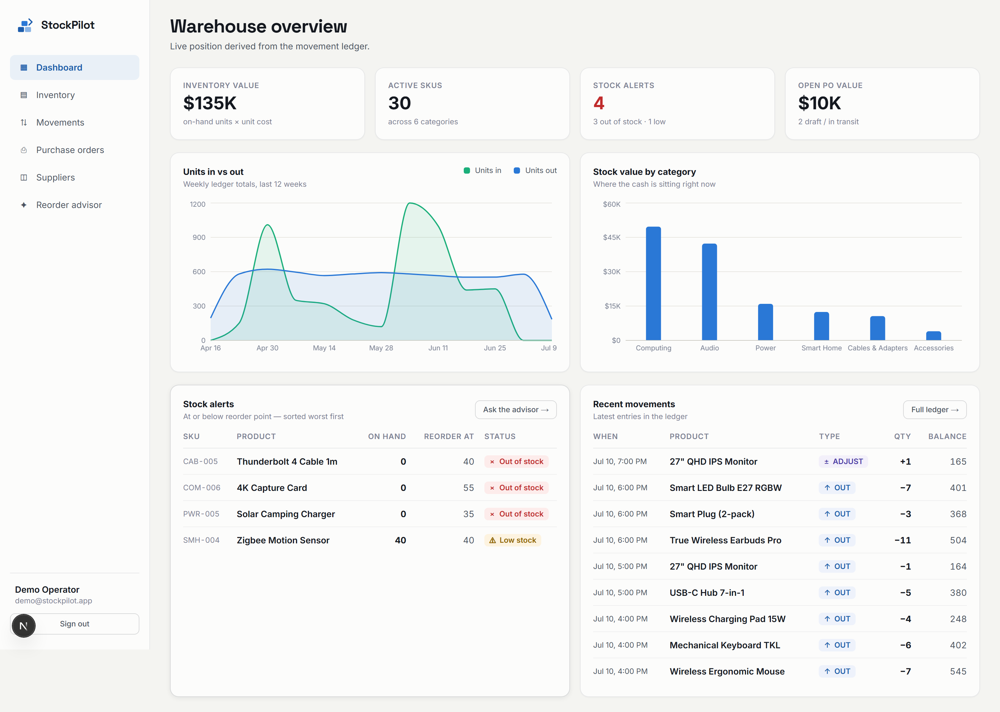
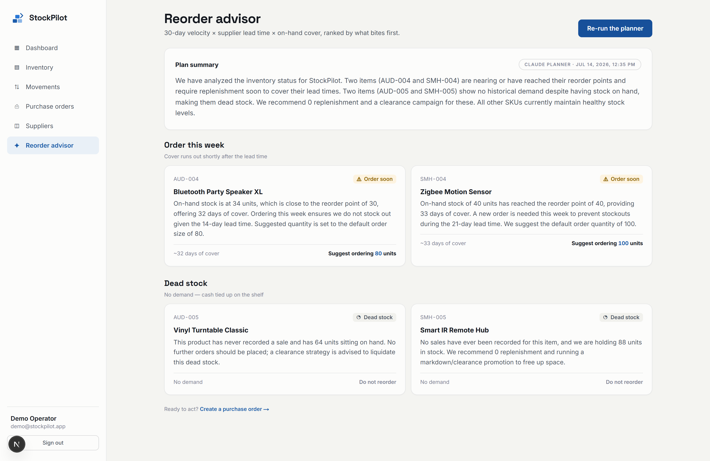
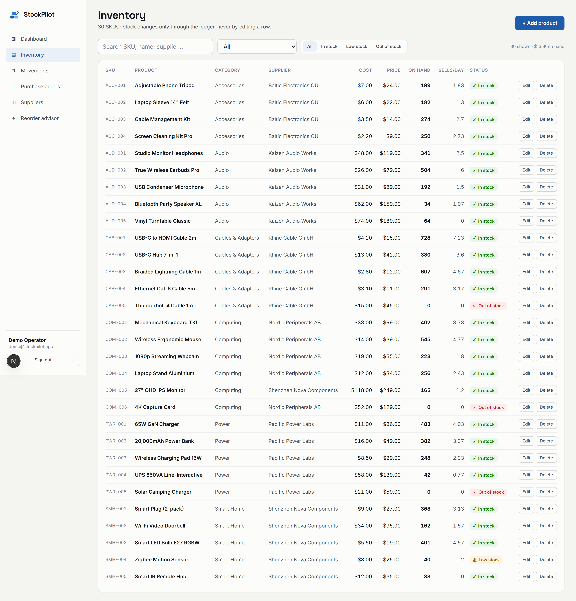
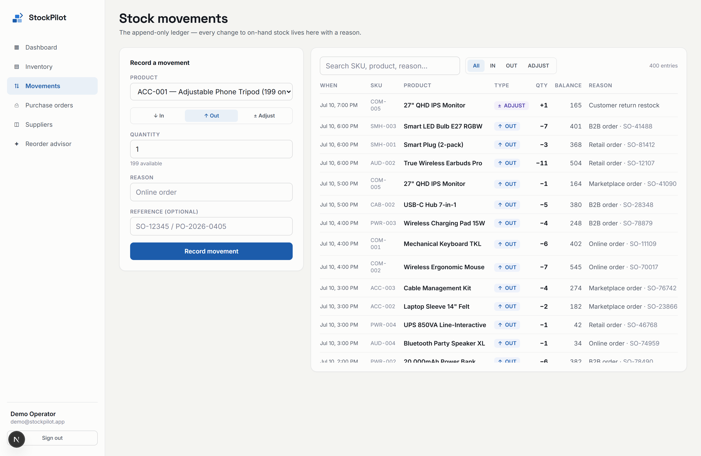
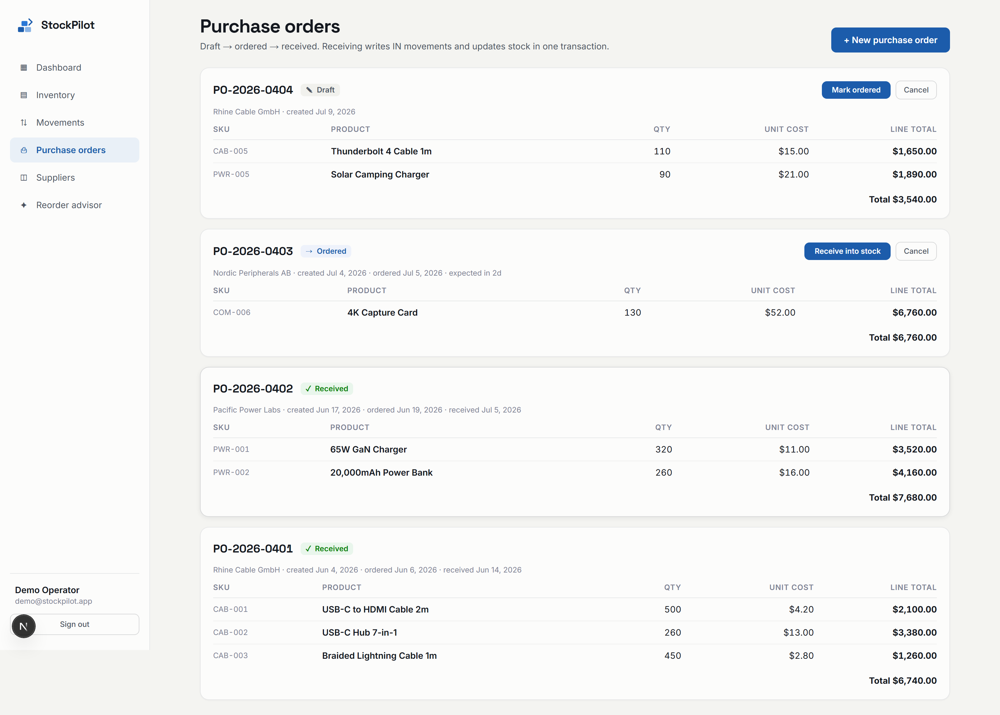
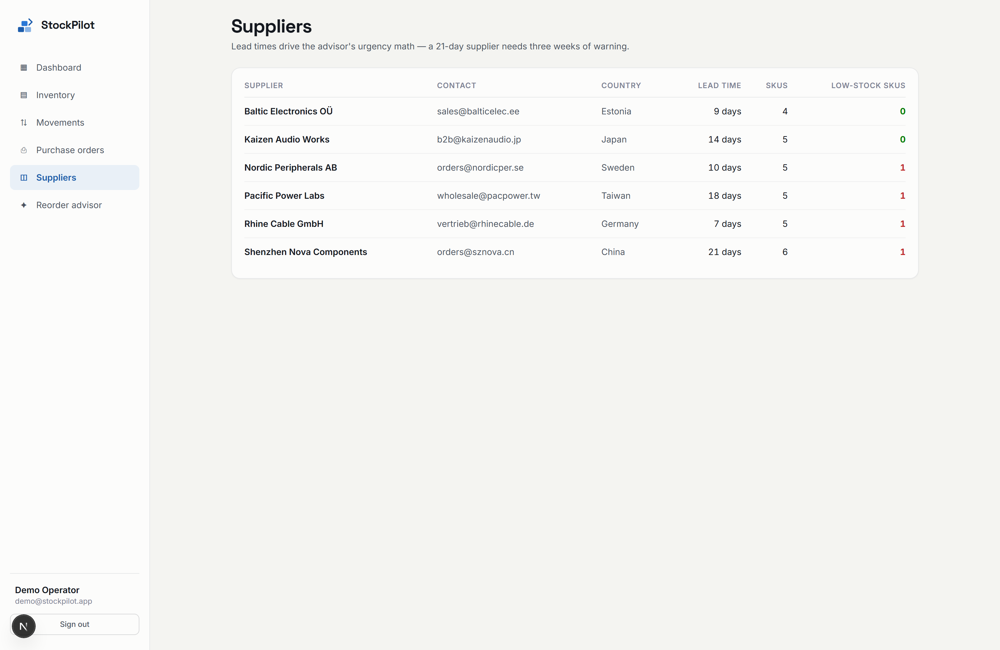

<div align="center">

# 📦 StockPilot

### Inventory Management System — inventory that warns you first

*A full-stack inventory console built on one idea: **stock is a ledger, not a number.** Every unit in or out is an immutable movement with a running balance, purchase orders receive into stock atomically, and an **AI reorder advisor** tells you what to order before it becomes a stockout.*

<br/>

### 🔗 See This Project Live

**▶ [https://stock-pilot-inventory-management-sy-eight.vercel.app](https://stock-pilot-inventory-management-sy-eight.vercel.app)**

<br/>

[](https://nextjs.org/)
[](https://react.dev/)
[](https://www.typescriptlang.org/)
[](https://tailwindcss.com/)
[](https://www.postgresql.org/)
[](https://www.prisma.io/)
[](https://recharts.org/)
[](https://www.anthropic.com/)

[](LICENSE)


</div>

---

## 📖 Overview

**StockPilot** is a full-stack Inventory Management System built around a single
principle: **stock is a ledger, not a number.** On-hand quantity is never typed
into a box — it is *derived* from an append-only history of movements, so the
books can never silently drift.

On top of that ledger it adds the things a spreadsheet can't:

- 🧾 **An append-only movement ledger** — every unit in or out is an immutable, timestamped movement (`IN` / `OUT` / signed `ADJUST`) that snapshots the resulting balance for full auditability.
- 🔒 **Race-safe writes** — ledger writes lock the product row in a transaction (`SELECT … FOR UPDATE`); an `OUT` that would oversell is rejected with a **409**.
- 📥 **Atomic purchase-order receiving** — receiving a PO increments stock *and* writes the matching `IN` movements in one Prisma transaction, so the books always agree.
- 🤖 **An AI reorder advisor** — Claude reads per-SKU velocity, days of cover, supplier lead time, and stock already inbound, then ranks **what to order now, what can wait, and which stock is dead cash** — with a transparent heuristic fallback so it always works.

> **The one-liner:** a Next.js 16 App-Router app where server components read a
> position derived entirely from a movement ledger, transactional route handlers
> keep on-hand and history in lock-step, and a Claude-powered advisor turns raw
> velocity into a ranked replenishment plan.

<div align="center">

**🔑 Demo login** &nbsp;·&nbsp; `demo@stockpilot.app` &nbsp;/&nbsp; `demo1234`

</div>

---

## 📸 Screenshots

### Dashboard — *warehouse overview, derived from the ledger*
> Four KPI tiles (inventory value, active SKUs, stock alerts, open-PO value), a weekly units-in vs units-out flow chart, stock value by category, a worst-first alert table, and the latest ledger entries.

<div align="center">
  
</div>

### Reorder Advisor — *the headline feature*
> Claude turns 30-day velocity × lead time × on-hand cover into a ranked plan: **Order this week** vs **Dead stock**, each with a plain-English rationale and a suggested quantity.

<div align="center">
  
</div>

<table>
  <tr>
    <td width="50%">
      <b>📋 Inventory</b><br/>
      <sub>SKU catalog with search + category/status filters. On-hand is deliberately not editable — stock only moves through the ledger.</sub><br/><br/>
      
    </td>
    <td width="50%">
      <b>🔁 Movements</b><br/>
      <sub>The append-only ledger with a record form (IN / OUT / signed ADJUST); every row snapshots the resulting balance.</sub><br/><br/>
      
    </td>
  </tr>
  <tr>
    <td width="50%">
      <b>🧾 Purchase Orders</b><br/>
      <sub>Draft → ordered → received status machine. Receiving increments stock and writes IN movements in one transaction.</sub><br/><br/>
      
    </td>
    <td width="50%">
      <b>🚚 Suppliers</b><br/>
      <sub>Directory with lead times — which drive the advisor's urgency math (a 21-day supplier needs three weeks of warning).</sub><br/><br/>
      
    </td>
  </tr>
</table>

<div align="center">
  <sub>Also included: a landing page and an email/password sign-in — see <a href="assets/screenshots/landing.png">landing</a> · <a href="assets/screenshots/login.png">login</a>.</sub>
</div>

---

## ✨ Features

| Area | What it does |
|------|--------------|
| 📊 **Dashboard** | Inventory value, stock alerts, open-PO exposure; weekly units-in vs units-out from the ledger; stock value by category; a worst-first alert table. |
| 📋 **Inventory** | Full SKU catalog CRUD with search and category/status filters. On-hand quantity is deliberately **not** editable — stock only changes through movements or PO receipts. |
| 🔁 **Movements** | The append-only ledger with a record form (IN / OUT / signed ADJUST). Writes lock the product row (`SELECT … FOR UPDATE`); oversells are rejected with a **409**; every entry snapshots the resulting balance. |
| 🧾 **Purchase orders** | Draft → ordered → received status machine with guards. Receiving increments stock and writes IN movements in one Prisma transaction. "Prefill low-stock SKUs" builds an order in one click. |
| 🚚 **Suppliers** | Directory with lead times, which drive the advisor's math. |
| 🤖 **Reorder advisor** | Claude reads per-SKU velocity (30-day), on-hand cover, supplier lead time, and inbound stock, then ranks what to order now, what can wait, and which stock is dead cash. Heuristic fallback when no key is set. |

> 📐 A deeper dive — the ledger transaction, the PO state machine, and the advisor math — lives in **[`docs/ARCHITECTURE.md`](docs/ARCHITECTURE.md)**.

---

## 🛠️ Tech Stack

| Layer | Technology |
|-------|-----------|
| **Framework** | Next.js 16 (App Router, Server Components) |
| **UI** | React 19 · Tailwind CSS 4 · Recharts |
| **Language** | TypeScript 5 |
| **Database** | PostgreSQL |
| **ORM** | Prisma 6 |
| **Auth** | next-auth (credentials, JWT) + bcryptjs |
| **AI** | Anthropic Claude (`@anthropic-ai/sdk`) · Google Gemini (optional) · heuristic fallback |

---

## 🚀 Getting Started

### Prerequisites
- **Node.js** 18.18+ (20+ recommended)
- **PostgreSQL** 14+ running locally (or a hosted connection string)

### Installation

```bash
# 1. Clone the repository
git clone https://github.com/bhanu87777/StockPilot-Inventory-Management-System.git
cd StockPilot-Inventory-Management-System

# 2. Install dependencies
npm install

# 3. Configure environment
cp .env.example .env
#   → set DATABASE_URL, generate AUTH_SECRET (openssl rand -base64 32),
#     and optionally add ANTHROPIC_API_KEY or GEMINI_API_KEY

# 4. Create the schema + seed 90 days of warehouse life
npx prisma db push       # creates the stockpilot database + tables
npm run db:seed          # 30 SKUs, 6 suppliers, ~2,400 movements, 4 POs

# 5. Run the dev server
npm run dev              # → http://localhost:3000
```

Then sign in with the demo account: **`demo@stockpilot.app` / `demo1234`**.

---

## 📋 Usage

| Command | Description |
|---------|-------------|
| `npm run dev` | Start the development server |
| `npm run build` | Production build |
| `npm run start` | Serve the production build |
| `npm run lint` | Run ESLint |
| `npm run db:seed` | Seed 90 days of demo warehouse data |
| `npx prisma db push` | Sync the Prisma schema to the database |
| `npx prisma studio` | Browse the data in Prisma Studio |

**How the demo data is made** — a seeded PRNG replays 90 days of warehouse life
per SKU: an opening balance, Poisson-ish daily sales (weekends slower), scheduled
replenishment for fast movers, and occasional cycle-count adjustments — then
engineers specific stories the app should catch: a fast mover stocked out with a
PO in transit, a SKU below its reorder point, and dead-stock items tying up cash.

---

## 📁 Project Structure

```
StockPilot-Inventory-Management-System/
├── assets/
│   └── screenshots/          # README imagery
├── docs/
│   ├── ARCHITECTURE.md       # ledger, PO state machine & advisor deep dive
│   ├── StockPilot_1_Features_Walkthrough.pdf
│   └── StockPilot_2_Codebase_Guide.pdf
├── prisma/
│   ├── schema.prisma         # User, Supplier, Product, StockMovement, PurchaseOrder, AdvisorRun
│   └── seed.ts               # 90-day deterministic warehouse generator
├── src/
│   ├── app/
│   │   ├── api/              # products, movements, purchase-orders, advisor, auth
│   │   ├── dashboard/ · inventory/ · movements/       # server-rendered pages
│   │   ├── purchase-orders/ · suppliers/ · advisor/
│   │   ├── login/ · signup/ · page.tsx (landing)
│   │   └── layout.tsx
│   ├── components/           # per-view UIs + charts + shell
│   └── lib/                  # the hub: inventory · advisor · auth · prisma · utils
├── .env.example
├── LICENSE
└── package.json
```

> `src/lib/` is the hub every part routes through — nothing touches the database
> or Claude directly except code in `lib`.

---

## 🔭 Future Improvements

- [ ] **Multi-warehouse / locations** — stock and transfers across sites
- [ ] **Barcode scanning** — receive and issue stock from a phone camera
- [ ] **Role-based access** — separate operator, purchasing, and viewer roles
- [ ] **Auto-generated POs** — one click from the advisor's "order this week" list
- [ ] **Demand forecasting** — seasonality-aware velocity instead of a 30-day mean
- [ ] **Export & reporting** — CSV / PDF stock valuation and movement reports
- [ ] **Test suite** — unit tests for the ledger transaction + advisor math

---

## 🤝 Contributing

Contributions, issues, and feature requests are welcome!

1. Fork the project
2. Create your feature branch (`git checkout -b feature/amazing-feature`)
3. Commit your changes (`git commit -m 'Add amazing feature'`)
4. Push to the branch (`git push origin feature/amazing-feature`)
5. Open a Pull Request

Please run `npm run lint` before submitting.

---

## 📄 License

Distributed under the **MIT License**. See [`LICENSE`](LICENSE) for details.

---

## 👤 Author

**Bhanu Prakash M**

[](https://github.com/bhanu87777)

> 💡 If StockPilot helped or impressed you, consider giving the repo a ⭐ — it genuinely helps!

<div align="center">
<sub>Built with Next.js 16, PostgreSQL, and Claude AI — around an append-only ledger that refuses to drift.</sub>
</div>
