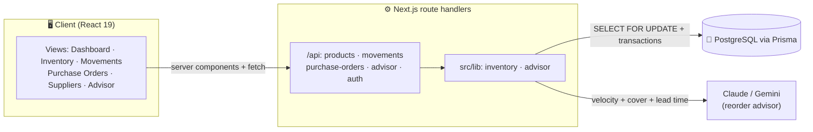
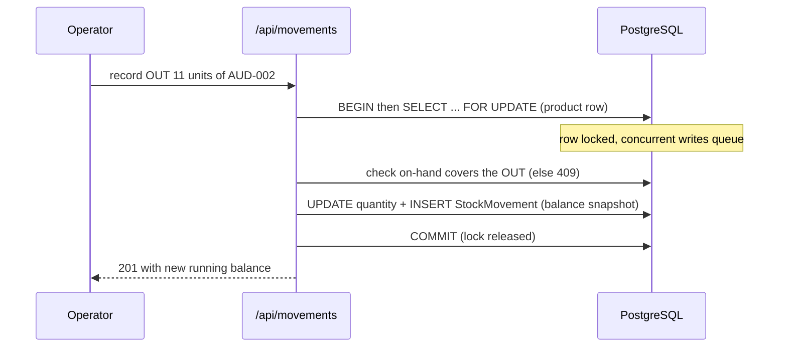

# 🏗️ StockPilot — Architecture

The one idea everything is built on: **stock is a ledger, not a number.**
On-hand quantity is *derived* from an append-only movement history — never
typed into a box — so the books can't silently drift.

---

## 1. The big picture

StockPilot is a single **Next.js 16 (App Router)** application — the API route
handlers *are* the backend. Nothing touches the database or the AI except code
in `src/lib/`. State lives in **PostgreSQL** through **Prisma**.



---

## 2. The core rule — on-hand is derived from the ledger

`Product.quantity` exists, but it is **only ever mutated inside a transaction**
that also writes a `StockMovement`. The UI deliberately makes on-hand
**non-editable** — the only ways stock changes are:

1. **Recording a movement** — `IN` (receipt), `OUT` (sale/issue), or a signed
   `ADJUST` (cycle count / shrinkage).
2. **Receiving a purchase order** — which writes `IN` movements.



Each movement **snapshots the resulting balance**, so the full history is
auditable without replaying every row. An `OUT` that would drive stock negative
is rejected with a **409** — you can't oversell the ledger.

---

## 3. Purchase orders — a guarded status machine

```
DRAFT ──▶ ORDERED ──▶ RECEIVED
   └────────▶ CANCELLED
```

Receiving a PO is **atomic**: in one Prisma transaction it increments each SKU's
stock *and* writes the matching `IN` movements, so the ledger and on-hand can
never disagree. "Prefill low-stock SKUs" builds a draft order in one click, and
a SKU can't be deleted while it sits on a draft/ordered PO.

---

## 4. The AI Reorder Advisor

The advisor turns the raw ledger into a **ranked replenishment plan**. For each
SKU it computes deterministic signals — 30-day sales **velocity**, **days of
cover** at that velocity, supplier **lead time**, and stock already **inbound**
on open POs — then asks Claude to classify and explain:

| Urgency | Meaning |
|---------|---------|
| `CRITICAL` | Will stock out before a new order can arrive |
| `SOON` | Stockout likely shortly after the lead time |
| `OK` | Healthy cover |
| `DEAD` | No demand — don't reorder, consider clearance |

Provider order: **Claude → Gemini → a transparent heuristic planner**, so the
advisor always returns a result (and every run is stored as an `AdvisorRun` with
its `ReorderSuggestion`s and the source that produced it).

---

## 5. Data model (`prisma/schema.prisma`)

| Model | Purpose |
|-------|---------|
| `User` | Operator account (bcrypt password hash). |
| `Supplier` | Directory with `leadTimeDays` — which drives the advisor's urgency math. |
| `Product` | A SKU: cost, price, `quantity` (derived), `reorderPoint`, `reorderQty`. |
| `StockMovement` | **The append-only ledger** — `type` (IN/OUT/ADJUST), qty, `balance` snapshot, reason, reference. |
| `PurchaseOrder` + `PurchaseOrderItem` | Draft→ordered→received status machine; receiving writes IN movements. |
| `AdvisorRun` + `ReorderSuggestion` | A stored advisor run with per-SKU urgency, suggested qty, days-of-cover and rationale. |

**Enums** — `MovementType` (IN/OUT/ADJUST) · `PoStatus` (DRAFT/ORDERED/RECEIVED/CANCELLED) · `Urgency` (CRITICAL/SOON/OK/DEAD) · `AdvisorSource` (AI/HEURISTIC).

---

## 6. Project layout

```
src/
├── app/
│   ├── api/
│   │   ├── products/route.ts · products/[id]/route.ts
│   │   ├── movements/route.ts               # ledger writes (SELECT … FOR UPDATE)
│   │   ├── purchase-orders/route.ts · [id]/route.ts   # status machine + receiving
│   │   ├── advisor/route.ts                 # run the reorder advisor
│   │   ├── register/route.ts · auth/[...nextauth]/route.ts
│   ├── dashboard · inventory · movements · purchase-orders · suppliers · advisor  # pages
│   ├── login · signup · page.tsx (landing) · layout.tsx
├── components/
│   ├── dashboard/ · inventory/ · movements/ · purchase-orders/ · advisor/  # per-view UIs
│   ├── charts/chartKit.tsx  · Badges.tsx · Shell.tsx · Logo.tsx · Providers.tsx
└── lib/
    ├── inventory.ts   # the hot path: ledger writes + PO receiving (transactions)
    ├── advisor.ts     # velocity/cover math + Claude/Gemini/heuristic planner
    ├── auth.ts · session.ts · prisma.ts · utils.ts
```

> `src/lib/` is the hub every part routes through — nothing touches the database
> or the AI except code in `lib`.

---

## 7. Auth

Email/password via **next-auth** (credentials, JWT sessions, bcrypt-hashed
passwords). Every page and API route requires a valid session; the login screen
pre-fills the demo operator so the app is one click from the warehouse.

---

## 8. v2 — Warehouses, lots, sales orders, and the platform layer

v2 keeps the one core rule and scales it out: **balances are now per
(product, warehouse)**, held in `StockLevel` rows; `Product.quantity` remains
as the denormalized total so every existing read stays cheap.

### 8.1 The ledger, per warehouse

The movement transaction now locks the **stock-level row** (not the product):
upsert the `(product, warehouse)` level, `SELECT … FOR UPDATE` it, check the
per-warehouse balance (409 on oversell), then update the level and atomically
increment the product total. Movements record `warehouseId`, an optional
`lotId`, and `createdById` — the ledger says *where* and *who*, not just what.

**Transfers** are paired `TRANSFER_OUT` / `TRANSFER_IN` movements sharing a
`TR-YYYY-NNNN` reference. Both level rows are locked **in warehouseId order**
so opposite concurrent transfers can never deadlock, and the product total is
conserved — no separate Transfer model; the ledger stays the audit surface.

### 8.2 Lots & FEFO

Perishable SKUs carry `Lot` rows (`lotCode`, `expiryDate`, `qtyRemaining`).
Lots are a pragmatic *allocation layer beneath the ledger*: `qtyRemaining` is a
guarded counter kept in sync inside the same transactions
(`updateMany … qtyRemaining >= qty`, 409 on overdraw), while `StockLevel`
remains the source of truth — the invariant is
`sum(qtyRemaining) <= StockLevel.quantity`. PO receiving auto-creates lots
from `shelfLifeDays`; the movement form pre-selects the earliest-expiring lot
(FEFO); sales-order fulfillment consumes lots FEFO automatically, one OUT
movement per lot slice.

### 8.3 Sales orders — the mirror of purchasing

`Customer` + `SalesOrder`/`SalesOrderItem` mirror the PO trio exactly
(DRAFT → CONFIRMED → FULFILLED / CANCELLED, `SO-YYYY-NNNN`, price snapshots at
creation). **Fulfillment is the mirror of receiving**: one transaction locks
each line's level at the order's warehouse, and if *any* line is short the
whole order rejects with a 409 — nothing partial ever hits the books.

### 8.4 RBAC, audit, notifications

- **Roles** (`ADMIN` / `PURCHASING` / `VIEWER`) ride in the JWT. A pure
  `can(role, action)` matrix (`lib/permissions.ts`) is shared by client views
  (button gating) and the server guard `requirePermission()` (401/403) — every
  mutating route enforces it.
- **Audit** rows are written *inside* the same transactions via
  `audit(tx, actor, …)` with dot-namespaced actions (`po.receive`,
  `so.fulfill`, `user.role_change`). No FK to User — rows snapshot the email
  and survive user deletion.
- **Notifications** are global facts with per-user read state
  (`NotificationRead`). They are emitted synchronously inside write
  transactions (low stock / stockout / received / fulfilled) and deduped by an
  unresolved-row check; overdue POs and expiring lots are swept lazily when
  the feed is fetched — no cron needed on serverless.

### 8.5 The luxury layer

Dark mode is pure CSS: both themes are validated token sets in `globals.css`
(`:root` / `:root[data-theme="dark"]`), stamped pre-paint by an inline script,
and the Recharts kit passes `var(--viz-*)` strings straight into SVG props so
charts re-theme with zero JS. The ⌘K palette fuzzy-matches static commands
client-side and debounces entity search through `GET /api/search`. Barcodes
are Code 128 SVGs from `bwip-js` (label sheets sized for A4 print CSS);
scanning needs no dependency — USB scanners are keyboard wedges, and camera
scanning feature-detects the `BarcodeDetector` Web API. CSV in and out share
one hand-rolled RFC-4180 util (BOM'd output, formula-injection guarded).
